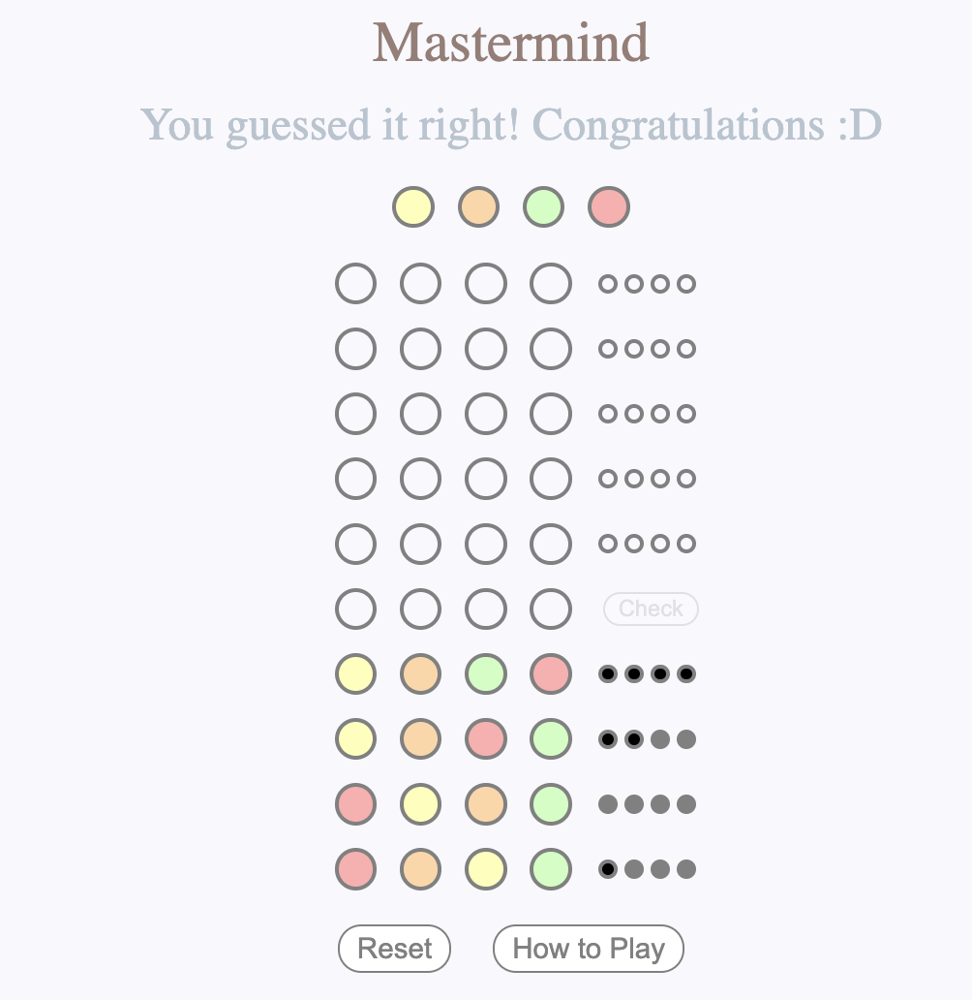
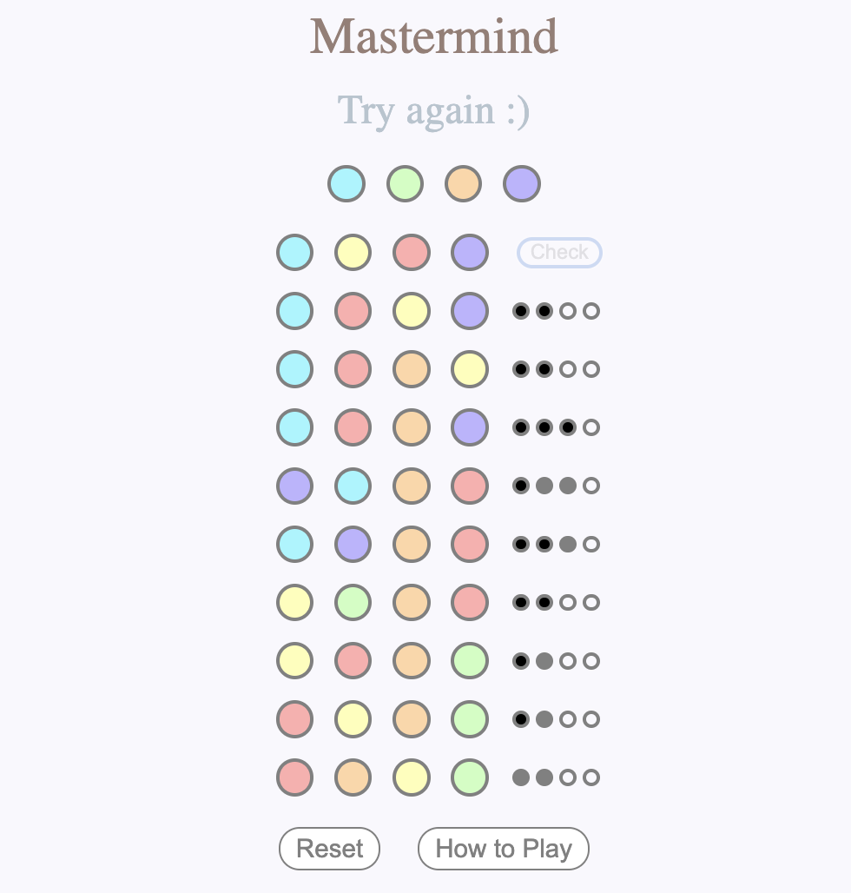

# Mastermind by Hayley

To win this Mastermind game, you will have to guess a combination of four pegs in 10 turns.

Starting from the bottom row, click on each peg to select a colour from the pop-up colour box.

Smaller pegs on the right hand side will tell you if there are any correct matches.

For more information on how to play the game, simply click on "How to Play" button next to the "Reset" button.

## Play Game

To play the game, click this link: [Mastermind](https://hayleykim.github.io/mastermind)

## Images

    
    

## Languages used

* HTML
* CSS
* JavaScript (a little bit of JSON)

## UX / UI

I tried to make it minimalistic and very straightforward in order for users to purely focus on the game :D 

To achieve a softer look, I've used pastel colours instead of stronger/ darker colours.

## Next Steps

* Adding some animation / sound would be nice to have
* Duplicate colours could also be a possibility for the winning colour combination

* Could add a timer or the number of wins/ loses

